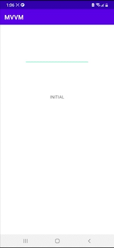

Android mvvm architecture sample
=================

A password app illustrating the use of Model View ViewModel (MVVM) architecture.

Introduction
------------

Password app demonstrates implementation of the MVVM architecture. Based on user input, verify the
strength of the password and update the ui accordingly. The app was build using java programming
language.

Getting Started
---------------

Clone or download the project, then run it.

Screenshots
-----------

Libraries Used
--------------

* [Foundation][0] - Components for core system capabilities and support for multidex and automated
  testing.
    * [AppCompat][1] - Degrade gracefully on older versions of Android.
    * [Test][2] - An Android testing framework for unit and runtime UI tests.
* [Executors][3] - For background tasks.
* [Architecture][10] - A collection of libraries that help you design robust, testable, and
  maintainable apps. Start with classes for managing your UI component lifecycle and handling data
  persistence.
    * [Lifecycles][12] - Create a UI that automatically responds to lifecycle events.
    * [Room][16] - Access your app's SQLite database with in-app objects and compile-time checks.
    * [LiveData][13] - Build data objects that notify views when the underlying database changes.
    * [ViewModel][17] - Store UI-related data that isn't destroyed on app rotations. Easily schedule
      asynchronous tasks for optimal execution.
* [UI][30] - Details on why and how to use UI Components in your apps - together or separate
    * [Material design][32] - for an expressive and adaptable design system.
    * [Layout][35] - Lay out widgets using different algorithms.

[0]: https://developer.android.com/jetpack/components

[1]: https://developer.android.com/topic/libraries/support-library/packages#v7-appcompat

[2]: https://developer.android.com/training/testing/

[3]: https://developer.android.com/guide/background/threading

[10]: https://developer.android.com/jetpack/arch/

[12]: https://developer.android.com/topic/libraries/architecture/lifecycle

[13]: https://developer.android.com/topic/libraries/architecture/livedata

[16]: https://developer.android.com/topic/libraries/architecture/room

[17]: https://developer.android.com/topic/libraries/architecture/viewmodel

[30]: https://developer.android.com/guide/topics/ui

[32]: https://material.io/develop/android

[35]: https://developer.android.com/guide/topics/ui/declaring-layout

License
-------

Copyright 2018 Google, Inc.

Licensed to the Apache Software Foundation (ASF) under one or more contributor license agreements.
See the NOTICE file distributed with this work for additional information regarding copyright
ownership. The ASF licenses this file to you under the Apache License, Version 2.0 (the "License");
you may not use this file except in compliance with the License. You may obtain a copy of the
License at

https://www.apache.org/licenses/LICENSE-2.0

Unless required by applicable law or agreed to in writing, software distributed under the License is
distributed on an "AS IS" BASIS, WITHOUT WARRANTIES OR CONDITIONS OF ANY KIND, either express or
implied. See the License for the specific language governing permissions and limitations under the
License.